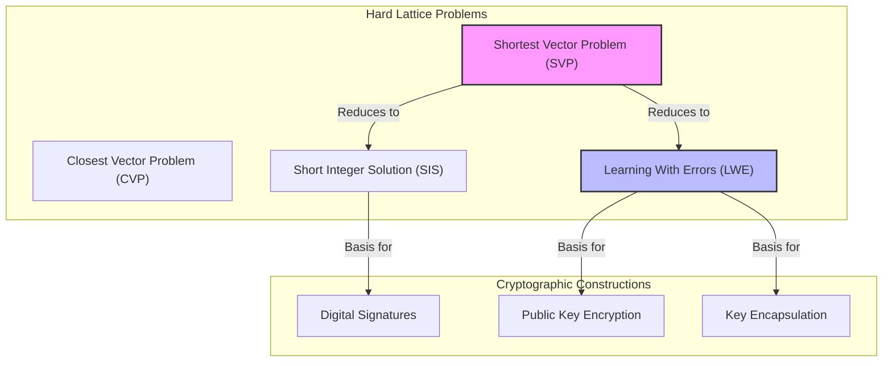

# 8 Post-quantum cryptography
**Tags:** #Cryptography #PostQuantumCryptography #PQC #QuantumComputing #LatticeBased #ShorAlgorithm #SVP #CVP #LWE #SIS #NIST #Standardization 

---

## 8.1 The Quantum Threat

The security of nearly all currently deployed [[6 Public-key encryption|public-key cryptography]] (RSA, Diffie-Hellman, ECC) relies on the hardness of **[[5 Number theory in cryptography|Factoring]]** and **[[5 Number theory in cryptography|Discrete Logarithm (DL)]]** problems.

* **Shor's Algorithm:** A quantum algorithm capable of solving Factoring and DL in polynomial time.
* **Implication:** A sufficiently powerful quantum computer would break all current standard public-key schemes.
* **Timeline:** While current quantum computers are small (factoring numbers like 15 or 21), scaling them to the billions of gates required to break RSA-2048 is a massive engineering challenge. However, it is considered a matter of *when*, not *if*.

**Why act now?**
1.  **"Store Now, Decrypt Later":** Adversaries can harvest encrypted traffic today and store it. Once a quantum computer is available (e.g., in 10-20 years), they can decrypt past secrets.
2.  **Migration Time:** Transitioning global infrastructure to new standards takes a decade or more.

To address this, NIST launched a standardization process for **Post-Quantum Cryptography (PQC)** in 2017.

---

## 8.2 Post-Quantum Cryptography (PQC)

**Definition:** PQC refers to cryptographic algorithms that run on **classical computers** but are believed to be secure even against **quantum computers**.

**Main Families of PQC:**
1.  **Lattice-based:** (Most popular, strong security proofs, efficient).
2.  **Code-based:** (Mature, but large key sizes).
3.  **Multivariate:** (Fast signatures, large keys).
4.  **Isogeny-based:** (Compact keys, but slow and mathematically complex).

**Note:** We focus here on **Lattice-based Cryptography**.

---

## 8.3 Introduction to Lattices

A lattice is a regular grid of points extending to infinity in $n$-dimensional space.

##### Definition 8.1: Lattice
> [!def] Definition 8.1
> Let $b_1, \dots, b_n \in \mathbb{R}^n$ be linearly independent vectors.
> The **Lattice** generated by the basis $B = (b_1, \dots, b_n)$ is the set of all integer linear combinations of the basis vectors:
> $$L(B) = \left\{ \sum_{i=1}^n z_i b_i : z_i \in \mathbb{Z} \right\} = B \cdot \mathbb{Z}^n$$

> **Figure 8.1: Lattice visualization**
> A lattice in 2 dimensions. The dots represent lattice points.

**Basis Non-Uniqueness:**
A single lattice can be generated by infinitely many different bases.
* **Good Basis:** Vectors are short and nearly orthogonal (easy to solve problems with).
* **Bad Basis:** Vectors are long and highly skewed (hard to solve problems with).
* **Relation:** Two bases $B$ and $B'$ generate the same lattice iff $B' = B \cdot U$, where $U$ is a **unimodular matrix** (integer matrix with determinant $\pm 1$).

---

## 8.4 Hard Lattice Problems

Security relies on problems that are easy to solve with a "Good Basis" (trapdoor) but hard to solve with a "Bad Basis" (public key).

### 1. Shortest Vector Problem (SVP)
Let $\lambda_1(L)$ denote the length of the shortest non-zero vector in the lattice $L$ (Euclidean norm).

**Problem:** Given a basis $B$, find a non-zero vector $v \in L$ such that $||v|| = \lambda_1(L)$.

**GapSVP (Approximate Version):**
Given a basis $B$, find a vector $v$ such that $||v|| \leq \gamma(n) \cdot \lambda_1(L)$, where $\gamma(n)$ is an approximation factor.
* For small $\gamma(n)$ (polynomial), this problem is NP-hard.
* Lattice crypto usually relies on the hardness for $\gamma(n) \approx n$ or $n^2$.

*Figure 8.2: The SVP asks for the closest lattice point to the origin (excluding the origin itself).*

### 2. Shortest Independent Vectors Problem (SIVP)
Let $\lambda_n(L)$ be the smallest radius needed to encompass $n$ linearly independent lattice vectors.
**Problem:** Given a basis $B$, find $n$ linearly independent vectors $v_1, \dots, v_n$ such that $\max ||v_i|| \leq \gamma(n) \cdot \lambda_n(L)$.

---

## 8.5 Modern Lattice Assumptions

Modern cryptographic schemes (like Kyber/Dilithium) are built on "Average-Case" problems that reduce to the worst-case hardness of lattice problems.

### A. Short Integer Solution (SIS)
This problem relates to finding collisions in hashing.

> [!def] Definition 8.2: SIS Problem
> Given a uniformly random matrix $A \in \mathbb{Z}_q^{n \times m}$ (where $m > n \log q$) and a bound $\beta$.
> Find a non-zero integer vector $z \in \mathbb{Z}^m$ such that:
> 1.  $Az \equiv 0 \pmod q$
> 2.  $||z|| \leq \beta$ (The vector is "short").

**Connection to Collisions:**
Define a function $f_A(x) = Ax \pmod q$.
Finding a solution to SIS is equivalent to finding a collision or preimage for this function (where inputs are restricted to short vectors).
* **Hardness:** Solving SIS is as hard as solving **GapSVP** on standard lattices.

### B. Learning With Errors (LWE)
This is the most versatile problem, used for encryption and signatures. It asks an adversary to solve a system of linear equations that has been "perturbed" by small noise.

> [!def] Definition 8.3: LWE Problem
> Let $s \in \mathbb{Z}_q^n$ be a secret vector.
> The adversary receives samples $(a_i, b_i)$ where:
> * $a_i \in_R \mathbb{Z}_q^n$ (Uniformly random vector)
> * $b_i = \langle a_i, s \rangle + e_i \pmod q$
> * $e_i$ is a small error term drawn from a noise distribution $\chi$ (e.g., Gaussian).
>
> **Search-LWE:** Find $s$.
> **Decision-LWE:** Distinguish $(a_i, b_i)$ from truly random pairs $(a_i, u_i)$.

*Figure 8.3: Without the error $e$, finding $s$ is simple Linear Algebra (Gaussian Elimination). The small error makes it computationally intractable.*

## 8.6 Learning With Errors (LWE)

The **Learning With Errors (LWE)** problem is the foundation for many modern lattice-based cryptographic schemes. It is an average-case problem that is believed to be hard even for quantum computers.

### Definition
For a security parameter $n$, the LWE distribution consists of pairs $(A, b) \in \mathbb{Z}_q^{m \times n} \times \mathbb{Z}_q^m$ obtained by sampling:
1.  A random matrix $A \in \mathbb{Z}_q^{m \times n}$.
2.  A random secret vector $s \in \mathbb{Z}_q^n$.
3.  An error vector $e$ from a distribution $\chi$ (typically small Gaussian noise).
4.  Computing $b = A s + e \pmod q$.

**Search-LWE:** Given $m$ samples $(a_i, b_i)$ from the distribution, find the secret $s$.
**Decision-LWE:** Distinguish samples $(A, b)$ formed via LWE from samples $(A, u)$ where $u$ is chosen uniformly at random from $\mathbb{Z}_q^m$.

### Hardness
* **Search vs. Decision:** For polynomial $q$, Search-LWE and Decision-LWE are equivalent.
* **Worst-case reduction:** Solving LWE is at least as hard as solving **GapSVP** (a hard lattice problem) with an approximation factor $\gamma(n) = \tilde{O}(\sqrt{n})$.
* **Role of Noise:** Without the error term $e$, the problem reduces to solving a system of linear equations (easy via Gaussian elimination). The error makes it computationally hard.

---

## 8.7 Regev's Public Key Encryption

Regev's scheme is the first efficient public-key encryption scheme based on LWE.

### 1. Key Generation
* **Secret Key ($sk$):** Sample a random vector $s \in \mathbb{Z}_q^n$.
* **Public Key ($pk$):**
    * Choose a matrix $A \in \mathbb{Z}_q^{m \times n}$ uniformly at random.
    * Sample error vector $e$.
    * Compute $b = A s + e$.
    * The public key is $(A, b)$  .

### 2. Encryption
To encrypt a bit $\mu \in \{0, 1\}$:
1.  Choose a random binary vector $r \in \{0, 1\}^m$ .
2.  Compute the ciphertext components:
    * $u = A^T r$
    * $v = b^T r + \mu \cdot \lfloor q/2 \rfloor$
3.  Output ciphertext $c = (u, v)$ .

### 3. Decryption
To decrypt ciphertext $c = (u, v)$ using secret key $s$:
1.  Compute $x = v - s^T u$ .
2.  This expands to:
    $$v - s^T u = (s^T A^T + e^T)r + \mu \lfloor q/2 \rfloor - s^T A^T r$$
    $$= e^T r + \mu \lfloor q/2 \rfloor$$
3.  If the error term $e^T r$ is small (less than $q/4$), the result is close to $0$ (if $\mu=0$) or close to $q/2$ (if $\mu=1$).
4.  Round to the nearest multiple of $q/2$ to recover $\mu$  .

### Security
* **Theorem:** Assuming LWE is hard, Regev's PKE is **CPA-secure**  .
* **Proof Sketch:**
    1.  Replace the public key $(A, b)$ with a truly uniform pair $(A, u)$ using the LWE assumption. No adversary can distinguish this  .
    2.  Use the **Leftover Hash Lemma (LHL)** to show that $A^T r$ is statistically close to uniform randomness because $r$ has sufficient entropy  .

---

## 8.8 Lattice-Based Signatures

There are two main paradigms for constructing digital signatures from lattices:
1.  **Lattice Trapdoors** (Hash-and-Sign, similar to RSA) .
2.  **Fiat-Shamir Transform** (Identification Schemes) .

### A. Fiat-Shamir Signatures (Lyubashevsky)
This approach builds a signature from an identification protocol based on the "Short Integer Solution" (SIS) problem.

**Protocol:**
1.  **Key:** Alice holds a short secret $x$ such that $Ax = u$. Public key is $(A, u)$  .
2.  **Commitment:** Prover picks a short random vector $y$ and sends $w = Ay$.
3.  **Challenge:** Verifier sends a small random challenge $\beta$ .
4.  **Response:** Prover computes $z = \beta x + y$ .
5.  **Verification:** Check if $Az = \beta u + w$ and if $z$ is short  .

**The Leakage Problem:**
The response $z = \beta x + y$ depends on the secret $x$. In a standard Schnorr-like protocol, the uniform distribution of $y$ masks the secret. However, in lattices, we require $z$ to be **short**. The sum of two short distributions is not necessarily uniform or safe; it might leak information about the geometry of $x$  . For example, if $\beta=1$, $z = x+y$, potentially revealing correlations  .

**The Fix: Rejection Sampling**
To achieve Zero-Knowledge (specifically Honest-Verifier Zero-Knowledge), the prover performs **Rejection Sampling**:
* After computing $z$, check if it falls within a "safe" region (invariant distribution).
* If $z$ is too large or creates a statistical bias, **ABORT** and restart the protocol  .
* This ensures the output distribution of $z$ is independent of the secret $x$ .

### B. Trapdoor Signatures (Hash-and-Sign)
This method uses a "Gadget Matrix" and lattice trapdoors.

**The Gadget Matrix ($G$):**
We define a specific matrix $G$ (e.g., powers of 2) for which solving SIS/LWE is easy.
$$g = (1, 2, 4, \dots, 2^{l-1})$$
Inverting $g$ (finding binary decomposition) is trivial  . This extends to a matrix $G = I_n \otimes g^T$ .

**Trapdoor Generation:**
We generate a random matrix $A$ together with a "trapdoor" $R$ (a short matrix) such that $A \cdot R = H \cdot G \pmod q$  .

**Signing:**
1.  Hash the message to a vector $u \in \mathbb{Z}_q^m$.
2.  Use the trapdoor $R$ to sample a short vector $x$ such that $Ax = u$  .
3.  The algorithm involves computing a preimage on the easy gadget matrix $G$ and mapping it back using $R$  .

**Verification:**
Check if $Ax = H(m)$ and if $x$ is short .