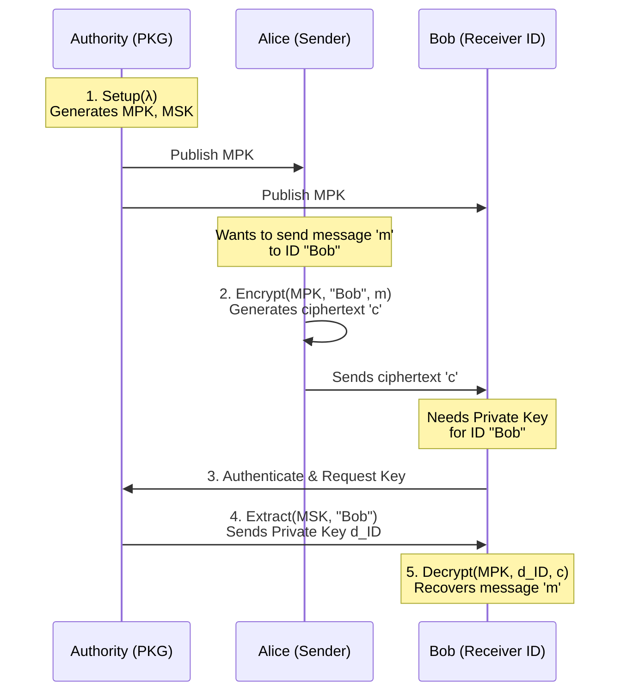

# 9 Identity-Based Encryption
**Tags:** #Cryptography #IdentityBasedEncryption #IBE #BilinearPairings #BonehBoyen #KeyEscrow #PKG #IND-ID-CPA 

---

## 9.1 Introduction to IBE

**Identity-Based Encryption (IBE)** is a form of [[6 Public-key encryption|public-key encryption]] where the public key can be an **arbitrary string** (e.g., an email address `alice@gmail.com` or a phone number).

### Motivation vs. PKI
* **Traditional [[6 Public-key encryption|PKI]]:** To encrypt for Bob, Alice needs Bob's public key certificate. This requires a Certificate Authority (CA) infrastructure to verify that a specific key belongs to Bob.
* **IBE Approach:** Alice derives the public key directly from Bob's identity. There is no need to look up a certificate.
* **The Authority:** A central "Authority" holds a **Master Secret Key (MSK)**. It generates private keys for users based on their identities.

**Key Escrow:** A unique property (or drawback) of IBE is **Key Escrow**. The Authority can generate any user's private key, meaning it can decrypt all communications.

### Formal Syntax
An IBE scheme $\Pi = (Setup, KeyGen, Enc, Dec)$ is defined as:
1.  **$Setup(1^\lambda)$:** Outputs Master Public Key ($mpk$) and Master Secret Key ($msk$).
2.  **$KeyGen(msk, ID)$:** Outputs a secret key $d_{ID}$ for the identity $ID$.
3.  **$Enc(mpk, ID, m)$:** Encrypts message $m$ for identity $ID$. Output $c$.
4.  **$Dec(mpk, d_{ID}, c)$:** Decrypts ciphertext $c$ using the identity's secret key.

---

## 9.2 Security Definition (IND-ID-CPA)

We define **Indistinguishability under Chosen Identity and Chosen Plaintext Attack (IND-ID-CPA)** via a game:
1.  **Setup:** Challenger runs $Setup$, gives $mpk$ to Adversary $\mathcal{A}$.
2.  **Query Phase:** $\mathcal{A}$ can query the key extraction oracle for any identity $ID_i$. Challenger returns $d_{ID_i}$.
3.  **Challenge:** $\mathcal{A}$ chooses a target identity $ID^*$ (not previously queried) and two messages $m_0, m_1$.
    * Challenger returns $c^* = Enc(mpk, ID^*, m_b)$.
4.  **Guess:** $\mathcal{A}$ outputs bit $b'$.

**Selective Security:** A weaker notion where the adversary must declare the target identity $ID^*$ **before** the Setup phase (i.e., before seeing $mpk$).

---

## 9.3 Bilinear Pairings

To construct IBE, we use **Bilinear Maps** (Pairings).
Let $G, G_T$ be cyclic groups of prime order $q$. A map $\hat{e}: G \times G \to G_T$ is a pairing if:
1.  **Bilinear:** $\forall g, h \in G, a, b \in \mathbb{Z}_q: \hat{e}(g^a, h^b) = \hat{e}(g, h)^{ab}$.
2.  **Non-degenerate:** $\hat{e}(g, g) \neq 1$.
3.  **Efficient:** Computable in polynomial time.

**Hardness Assumption: Decisional Bilinear Diffie-Hellman (DBDH)**
Given $(g, g^a, g^b, g^c, T)$, it is hard to distinguish if $T = \hat{e}(g, g)^{abc}$ or if $T$ is a random element in $G_T$.

---

## 9.4 IBE Construction (Boneh-Boyen style)

This construction is **Selective IND-ID-CPA secure** under the DBDH assumption.

### Algorithms
* **$Setup(1^\lambda)$:**
    * Generate groups with pairing. Pick generator $g \in G$.
    * Pick random $\alpha \in \mathbb{Z}_q$. Set $g_1 = g^\alpha$.
    * Pick random $g_2, h \in G$.
    * **$mpk = (g, g_1, g_2, h)$**.
    * **$msk = g_2^\alpha$**.

* **$KeyGen(msk, ID)$:**
    * Compute user-specific point $F(ID) = g_1^{ID} \cdot h$.
    * Pick random $r \in \mathbb{Z}_q$.
    * Compute private key $d_{ID} = (d_0, d_1)$ where:
        $$d_0 = g_2^\alpha \cdot F(ID)^r, \quad d_1 = g^r$$

* **$Enc(mpk, ID, m)$:**
    * Pick random $\gamma \in \mathbb{Z}_q$.
    * Compute ciphertext $c = (u, v, w)$:
        $$u = \hat{e}(g_1, g_2)^\gamma \cdot m$$
        $$v = g^\gamma$$
        $$w = F(ID)^\gamma = (g_1^{ID} \cdot h)^\gamma$$

* **$Dec(mpk, d_{ID}, c)$:**
    * Parse $c = (u, v, w)$ and $d_{ID} = (d_0, d_1)$.
    * Compute:
        $$m = \frac{u \cdot \hat{e}(d_1, w)}{\hat{e}(v, d_0)}$$
    * **Correctness Logic:** The term $\hat{e}(d_1, w)$ cancels out the "blinding" factor $F(ID)^r$ in $d_0$ against $v$, leaving $\hat{e}(v, g_2^\alpha) = \hat{e}(g^\gamma, g_2^\alpha) = \hat{e}(g_1, g_2)^\gamma$, which decrypts $u$.

---

## 9.5 Security Proof (Selective ID)

**Theorem:** Under the DBDH assumption, the scheme is Selectively IND-ID-CPA secure.

**Proof Sketch (Reduction):**
We construct a simulator $\mathcal{B}$ that solves DBDH using an IBE adversary $\mathcal{A}$.
1.  **Input:** $\mathcal{B}$ receives $(g, A=g^a, B=g^b, C=g^c, T)$. Goal: Determine if $T = \hat{e}(g, g)^{abc}$.
2.  **Setup:** $\mathcal{A}$ announces target $ID^*$.
    * $\mathcal{B}$ sets parameters such that it *knows* the secret keys for any $ID \neq ID^*$, but the secret key for $ID^*$ involves the unknown term $g^{ab}$.
    * Sets $g_1 = A$ (so $\alpha = a$, unknown).
    * Sets $h = g_1^{-ID^*} \cdot g^z$ (a programmed hash).
    * This implies $F(ID^*) = g_1^{ID^*} \cdot (g_1^{-ID^*} \cdot g^z) = g^z$.
    * For $ID \neq ID^*$, $F(ID)$ retains a $g_1$ component allowing cancellation.
3.  **Extraction Queries ($ID \neq ID^*$):**
    * $\mathcal{B}$ can mathematically simulate valid private keys $d_{ID}$ by choosing randomness $r$ carefully to cancel out the unknown $\alpha$ component.
4.  **Challenge ($ID^*$):**
    * To encrypt for $ID^*$, we need $\hat{e}(g_1, g_2)^\gamma$.
    * Let $g_2 = B$ and implicitly $\gamma = c$.
    * The "pad" is $\hat{e}(A, B)^c = \hat{e}(g, g)^{abc}$.
    * $\mathcal{B}$ uses the challenge term $T$ as the pad.
    * If $T$ is real, this is a valid encryption. If $T$ is random, $m_b$ is perfectly hidden.

---

## 9.6 Applications of IBE

### 1. CCA-Secure PKE (The CHK Transform)
Canetti, Halevi, and Katz (CHK) showed how to convert any IBE scheme into a **CCA-Secure** Public Key Encryption scheme.

**Construction:**
* **KeyGen:** Run $IBE.Setup$. $pk = mpk$, $sk = msk$.
* **Enc:** To encrypt $m$:
    1.  Generate a **One-Time Signature (OTS)** key pair $(vk, sk_{sig})$.
    2.  Treat the verification key $vk$ as an **Identity**.
    3.  Compute $c_{IBE} = IBE.Enc(mpk, ID=vk, m)$.
    4.  Sign the ciphertext: $\sigma = Sign(sk_{sig}, c_{IBE})$.
    5.  Output $C = (vk, c_{IBE}, \sigma)$.
* **Dec:**
    1.  Verify signature $\sigma$ with $vk$.
    2.  Use $msk$ to derive the IBE secret key for identity $vk$: $d_{vk} \leftarrow IBE.Extract(msk, vk)$.
    3.  Decrypt $c_{IBE}$ using $d_{vk}$.

**Security:** If the IBE is Selectively-CPA secure and the OTS is strongly unforgeable, the resulting PKE is CCA secure.

### 2. Digital Signatures from IBE
We can interpret IBE algorithms as a signature scheme:
* **Master Public Key** $\to$ Signature Verification Key.
* **Master Secret Key** $\to$ Signature Signing Key.
* **Identity** $\to$ The Message to be signed.
* **IBE Secret Key extraction** $\to$ Generating a signature.

**Scheme:**
* **$Sign(msk, m)$:** Output $\sigma \leftarrow IBE.KeyGen(msk, ID=m)$.
* **$Verify(mpk, m, \sigma)$:** To verify, encrypt a random challenge $m'$ under identity $m$. Check if $\sigma$ can decrypt it.
* **Security:** If the IBE is One-Way Chosen Identity (OW-ID-CPA), the signature is secure against existential forgery.

---

## 9.7 From Selective to Full Security

**Theorem:** Any Selectively Secure IBE is also Fully Secure (Adaptive ID), but with a loss in security tightness.
* **Reduction:** If an adversary breaks full security with probability $\epsilon$, they break selective security with probability $\epsilon / N$, where $N$ is the size of the identity space.
* **Method:** The reduction algorithm simply **guesses** the target identity $ID^*$ at the beginning. If the adversary chooses a different $ID^*$, the reduction aborts. Since the guess is correct with probability $1/N$, the reduction still works (albeit inefficiently).