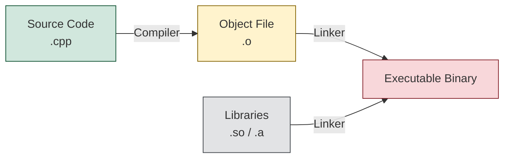

**Tags:** #Compilers #CMake #Make #BuildSystems #Cpp #RobotProgramming #GCC #Linking #Linux #DevOps 
![[rp_01_compilers_and_build_systems.pdf]]

---

## 1. Program Execution Basics

### Machine Code & CPU
* **Execution:** Programs are executed directly by the CPU (native execution) or via an interpreter/emulator (Virtual Machine).
* **CPU Cycle:** The CPU sequentially fetches binary instructions and operands from RAM, processes them, and stores the results in registers or memory.
* **Assembly:** Machine instructions consists of binary digits, which have a 1-to-1 correspondence with alphanumeric Assembly language opcodes.


![[Pasted image 20260126031601.png]]


### Interpreters vs. Bytecode
* **Bytecode:** Some languages compile to a portable "virtual" machine code (bytecode) rather than native machine code. This requires an emulator (VM) to run.
* **JIT:** Just-In-Time (JIT) compilation can translate bytecode into native machine code at runtime to improve performance.
* **Interpreters:** These programs directly execute source files by parsing and running the code on the spot (e.g., Python, Bash, Matlab/Octave).

---

## 2. The Build Process (C/C++)

Building a program transforms human-readable source code into an executable binary image.

### Program Structure
* **Source Files:** `.c`, `.cpp` (Contains the implementation).
* **Headers:** `.h`, `.hpp` (Contains definitions/declarations).
* **Object Files:** `.o` (Compiled intermediate files).
* **Libraries:**
    * `.a`: Static libraries.
    * `.so`: Shared (dynamic) libraries (Linux equivalent of DLLs).

### Compilation Pipeline
The transformation from source to execution involves several steps:



1.  **Compiler/Assembler:** Translates source code into **object modules** (`.o`).
    * *Command Example:* `g++ -c hello_world.cpp` -> generates `hello_world.o`.
2.  **Linker (Linkage Editor):** Combines multiple object files and libraries into a final **load module** (executable).
    * *Command Example:* `g++ -o hello_world hello_world.o` (Links to system libraries).
3.  **Loader:** When the program is run, the OS loads the binary image into memory and resolves **dynamic libraries** (`.so`) at runtime.


### Manual Building (The Problem)
For large projects partitioned into many files, compiling manually via terminal commands is inefficient.
* If a single header file changes, you must manually determine which source files depend on it and recompile only those to save time.
* Doing this by hand (`g++ ...`) is error-prone and tedious.


---

## 3. Automation Tools

### Makefiles
`Make` is a tool designed to automate the build process using a configuration file named `Makefile`. It tracks the modification time of files to execute commands only when necessary (i.e., if a source file is newer than its corresponding object file).

* **Rule Syntax:**
    ```makefile
    target: dependencies
        command
    ```
    *Example:*
    ```makefile
    vec3.o: vec3.c vec3.h
        gcc -c -o vec3.o vec3.c
    ```

* **Variables:** Makefiles support variables to keep configuration clean (e.g., defining the compiler `CC=gcc` or flags `LIBS=-lglut`).
* **Usage:** Running the command `make` in the directory triggers the dependency check and compilation rules.

### External Libraries & `pkg-config`
Complex projects rely on external packages (like OpenGL, Eigen). Finding the correct paths for headers (`-I`) and libraries (`-L`) varies across systems.

* **pkg-config:** A helper tool that reads `.pc` files installed by packages to provide the correct compilation flags.
    * *Usage:* `pkg-config --cflags --libs gl` outputs the exact flags needed for the compiler.
    * *In Makefile:* `LIBS=$(shell pkg-config --libs glut)`.

---

## 4. CMake (Cross-Platform Make)

`CMake` is a meta-build system. Instead of writing Makefiles directly (which can be platform-dependent), you write a `CMakeLists.txt` file. CMake then **generates** the standard Makefiles (or Visual Studio project files) for your specific system.

### Workflow
1.  **Configure:** Write a `CMakeLists.txt` file.
2.  **Generate:** Run `cmake .` (or `cmake -B build`) to generate the Makefile.
3.  **Build:** Run `make` to compile the project.

### Basic `CMakeLists.txt` Structure
```cmake
# 1. Initialization
cmake_minimum_required(VERSION 2.8.11)
project(so_game)

# 2. Find Dependencies (Automation of pkg-config logic)
find_package(OpenGL REQUIRED)
find_package(GLUT REQUIRED)

# 3. Include Directories
include_directories(${OPENGL_INCLUDE_DIRS} ${GLUT_INCLUDE_DIRS})

# 4. Define Target (Executable)
add_executable(so_game
    so_game.c
    world.c
    # ... add other source files here
)

# 5. Link Libraries
target_link_libraries(so_game
    ${OPENGL_gl_LIBRARY}
    ${GLUT_glut_LIBRARY}
    m
)