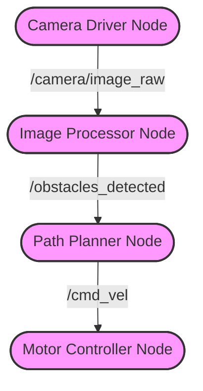

# Introduction to ROS (Robot Operating System)
**Tags:** #ROS #Middleware #Robotics #Nodes #Topics #Services #Communication #PubSub 
![[rp_03_ROS_introduction.pdf]]

---

## 1. What is ROS?

**ROS (Robot Operating System)** is not a traditional operating system (like Windows or Linux). It is a **Meta-Operating System** or **Middleware**.
It provides the plumbing and tools to help software components (nodes) communicate and work together.

**Key Features:**
* **Hardware Abstraction:** Drivers for cameras, lasers, motors, etc. (often using [[Transform and sensors#3. The TF Library (Transforms)|TF]]).
* **Device Control:** Low-level control libraries.
* **Message Passing:** A standard way for processes to talk to each other.
* **Package Management:** Easy distribution and reuse of code.
* **Tools:** Visualization (Rviz), Simulation (Gazebo), Debugging.

**Philosophy:**
ROS is **Distributed**, **Modular**, and **Language Independent** (C++, Python, etc.). It encourages reusing code ("Don't reinvent the wheel").

---

## 2. Core Concepts

### Nodes
A **Node** is a single executable process (a program).
* A robot system is typically made up of many ([[ROS introduction#Nodes|nodes]]) (e.g., one node reads the laser, another controls the motors, another plans the path).
* Nodes can run on the same computer or on different computers across a network.

### The Master (roscore)
The **ROS Master** acts as a name service/DNS for the ROS system.
* It allows nodes to find each other.
* Without the Master, nodes cannot communicate.
* *Command:* `roscore` (must be running before starting any node).

### Communication Paradigms



1.  **[[ROS introduction#Communication Paradigms|Topics]] (Publish/Subscribe):**
    * Used for continuous data streams (sensor data, robot state).
    * **One-to-Many:** A publisher node sends data; many subscriber nodes can read it.
    * **Asynchronous:** The publisher doesn't care who receives the data.
    

2.  **[[ROS introduction#Communication Paradigms|Services]] (Request/Response):**
    * Used for specific tasks or queries (e.g., "Take a picture now", "Calculate path").
    * **One-to-One:** A client sends a request; the server replies with a response.
    * **Synchronous:** The client waits until the response arrives.
    

3.  **Actions:**
    * Used for long-running tasks (e.g., "Go to room B").
    * Provides feedback (progress) and allows cancellation.

---

## 3. ROS Filesystem

ROS code is organized into **Packages**.

* **Package:** The main unit of software organization. Contains source code, libraries, scripts, and a `package.xml` manifest.
* **Workspace:** A directory where you build and develop your ROS packages.

**Key Files:**
* `package.xml`: Defines package metadata (name, version, dependencies).
* `CMakeLists.txt`: Build configuration (tells Catkin how to compile the code).

---

## 4. The Build System: Catkin

**Catkin** is the build system for ROS (based on [[Compiler and build system#4. CMake (Cross-Platform Make)|CMake]]).

### Creating a Workspace
```bash
mkdir -p ~/catkin_ws/src
cd ~/catkin_ws/src
catkin_init_workspace
cd ~/catkin_ws
catkin_make
```

### Sourcing
To make ROS commands available (and to use your compiled code), you must "source" the setup file in every new terminal:
```bash
source /opt/ros/noetic/setup.bash      # For system ROS installation
source ~/catkin_ws/devel/setup.bash    # For your workspace
```
*(Tip: Add this to your `.bashrc` file to do it automatically).*

---

## 5. Basic Commands

**Navigation:**
* `roscd <package>`: Jump to a package directory.
* `rosls <package>`: List files in a package.

**Running Nodes:**
* `rosrun <package> <executable>`: Run a specific node.
* `roslaunch <package> <launchfile>`: Launch multiple nodes at once (using XML launch files).

**Information:**
* `rosnode list`: List active nodes.
* `rostopic list`: List active topics.
* `rostopic echo <topic>`: Print messages published to a topic.
* `rosservice list`: List available services.

---

## 6. Developing a Simple Node (C++)

### 1. Create Package
```bash
cd ~/catkin_ws/src
catkin_create_pkg my_first_package roscpp std_msgs
```
*(Dependencies: `roscpp` for C++, `std_msgs` for standard message types).*

### 2. Publisher Code (`src/publisher.cpp`)
```cpp
#include "ros/ros.h"
#include "std_msgs/String.h"

int main(int argc, char **argv) {
  ros::init(argc, argv, "talker"); // Initialize node
  ros::NodeHandle n;
  
  // Create publisher on topic "chatter" with buffer size 1000
  ros::Publisher chatter_pub = n.advertise<std_msgs::String>("chatter", 1000);
  
  ros::Rate loop_rate(10); // 10 Hz
  
  while (ros::ok()) {
    std_msgs::String msg;
    msg.data = "Hello World";
    
    chatter_pub.publish(msg); // Send message
    
    ros::spinOnce();
    loop_rate.sleep();
  }
  return 0;
}
```

### 3. Subscriber Code (`src/subscriber.cpp`)
```cpp
#include "ros/ros.h"
#include "std_msgs/String.h"

// Callback function
void chatterCallback(const std_msgs::String::ConstPtr& msg) {
  ROS_INFO("I heard: [%s]", msg->data.c_str());
}

int main(int argc, char **argv) {
  ros::init(argc, argv, "listener");
  ros::NodeHandle n;
  
  // Subscribe to topic "chatter"
  ros::Subscriber sub = n.subscribe("chatter", 1000, chatterCallback);
  
  ros::spin(); // Enter loop and wait for callbacks
  return 0;
}
```

### 4. Build Configuration (`CMakeLists.txt`)
Add these lines to compile the nodes:
```cmake
add_executable(talker src/publisher.cpp)
target_link_libraries(talker ${catkin_LIBRARIES})

add_executable(listener src/subscriber.cpp)
target_link_libraries(listener ${catkin_LIBRARIES})
```

### 5. Compile and Run
```bash
cd ~/catkin_ws
catkin_make
source devel/setup.bash

# Terminal 1:
roscore

# Terminal 2:
rosrun my_first_package talker

# Terminal 3:
rosrun my_first_package listener
```