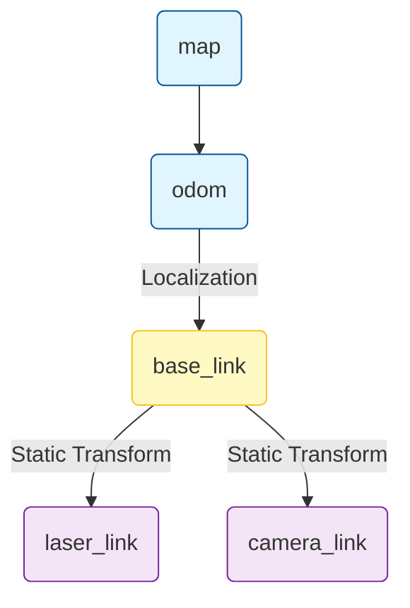

# Transforms (TF) and Sensors
**Tags:** #ROS #TF #Kinematics #Sensors #Lidar #Camera #Odometry #CoordinateFrames #LinearAlgebra 
![[rp_11b_ROS2_robot_setup.pdf]]

---

## 1. Accessing Devices in ROS

In ROS, every hardware device (sensor or actuator) is encapsulated as a **[[ROS introduction#Nodes|Node]]**.

### Interaction Paradigm
* **[[ROS introduction#Communication Paradigms|Input Topics]]:** Commands sent to the device (e.g., "move forward").
* **[[ROS introduction#Communication Paradigms|Output Topics]]:** Feedback/Data coming from the device (e.g., "laser scan data").
* **Parameters:** Configuration settings (e.g., serial port, resolution, max speed) set at startup.

**Standard Messages:**
Most sensors use standard types defined in `sensor_msgs` (e.g., `LaserScan`, `Image`, `Imu`).
To inspect a message structure:
```bash
rosmsg show sensor_msgs/LaserScan
```

---

## 2. The Mobile Base

A mobile robot base typically acts as both a sensor (odometry) and an actuator (motors).

### Published Topic: Odometry
* **Topic Type:** `nav_msgs/Odometry`
* **Content:**
    * Position ($x, y, z$) and Orientation (Quaternion).
    * Linear and Angular Velocities.
* **Frame:** Usually describes the transform from `odom` frame to `base_link` frame.

### Subscribed Topic: Velocity Command
* **Topic Type:** `geometry_msgs/Twist`
* **Content:** Desired linear velocity ($v_x$) and angular velocity ($\omega_z$).
* **Behavior:** The robot driver reads this message and converts it into motor currents to achieve the requested speed.


---

## 3. The TF Library (Transforms)

Robots have many moving parts and sensors, each with its own coordinate frame (e.g., `base_link`, `laser_frame`, `camera_link`, `map`). The **TF (Transform)** library keeps track of the relationships between these frames over time.

### The Transform Tree
The [[Transform and sensors#3. The TF Library (Transforms)|TF]] library maintains a **tree structure** of coordinate frames.
* **Edges:** Represents the relative pose (translation + rotation) between a parent frame and a child frame.


* **Root:** Typically the `map` or `world` frame.
* **Constraint:** The structure must be a tree (no cycles); each child has exactly one parent.

### Time and Interpolation
Transforms are dynamic (the robot moves!).
* TF buffers transforms for a few seconds (default 10s).
* When you ask for the position of the laser w.r.t. the map at time $t$, TF interpolates the available data to give an accurate answer for that specific timestamp.
* **Why?** Sensor data arrives with a timestamp. To process it correctly, you need the robot's pose *at that exact moment*, not "now".

### Broadcasters and Listeners
* **Broadcaster (Publisher):** A node that calculates a relative pose (e.g., odometry or a joint state) and sends it to `/tf`.
* **Listener (Subscriber):** A node that wants to transform data. It listens to `/tf`, rebuilds the tree, and allows querying coordinates across frames.

---

## 4. Static Transforms

Some transforms never change (e.g., the position of the laser mounted on the robot chassis). Instead of writing a C++ node to publish this constantly, ROS provides a command-line tool.

**static_transform_publisher:**
Publishes a fixed transform between two frames.

**Command Syntax:**
```bash
# x y z yaw pitch roll frame_id child_frame_id period_ms
rosrun tf static_transform_publisher 0.2 0 0.1 0 0 0 base_link laser_frame 100
```
*This says: "The laser_frame is 20cm forward and 10cm up from base_link, effectively rigidly attached."*

**Launch File Usage:**
You can include this in a `.launch` file to start it automatically:
```xml
<launch>
    <node pkg="tf" type="static_transform_publisher" name="laser_broadcaster" 
          args="0.2 0 0.1 0 0 0 base_link laser_frame 100" />
</launch>
```

---

## 5. Using TF in Code (C++)

To transform data (e.g., a point) from one frame to another:

### 1. Transform Listener
Create a listener object. It starts receiving `/tf` messages in the background.
```cpp
#include <tf/transform_listener.h>

tf::TransformListener listener;
```

### 2. Waiting for Transforms
Since data travels over the network, the specific transform you need might not be in the buffer yet.
```cpp
// Wait for the transform from "laser_frame" to "odom" at time 'scan_time'
listener.waitForTransform("odom", "laser_frame", scan_time, ros::Duration(1.0));
```

### 3. Lookup Transform
Retrieve the geometric transformation.
```cpp
tf::StampedTransform transform;
try {
    listener.lookupTransform("odom", "laser_frame", scan_time, transform);
} catch (tf::TransformException &ex) {
    ROS_ERROR("%s", ex.what());
}

// Use the transform
double x = transform.getOrigin().x();
double yaw = tf::getYaw(transform.getRotation());
```
